

  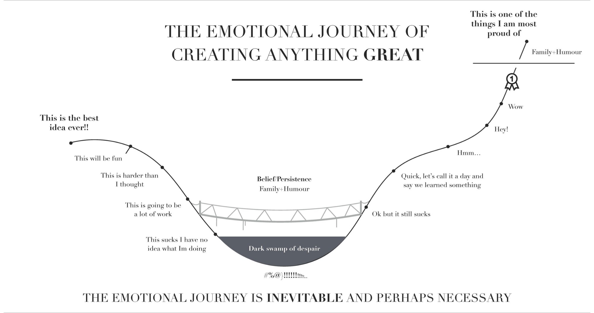

  

 

 

 
 
 

 
 
 

# Dude, What's That Car?
## Automobile Image Classifier
##### <em>by Marc Russell</em>
##### <em>Capstone II Project for Galvanize Data Science Immersive, Week 8</em>

 

## Table of Contents
- [Introduction](#introduction)
  - [Motivation](#motivation)
  - [Goals](#goals)
    - [Minimum Viable Product](#minimum-viable-product)
    - [Near-Future Goals (MVP+)](#near-future-goals-(MVP+))
    - [Far-Future Goals (MVP++)](#far-future-goals-(MVP+))
  - [The Data](#the-data)
- [Image Pipeline](#image-pipeline)
  - [Transformations](#transformations)
- [Model](#model)
- [Conclusion](#conclusion)
- [Citation](#citation)

# Introduction

## Motivation 

Law enforcement are commonly tasked with confirming that license plates match
the vehicle that they are attached to. 

This job is greatly assisted by automatic license plate reader/recognition technology (ALPR) which relays the licence plate number to the officer. After the ALPR sends the plate number to the officer’s mobile computer, there is one tedious task remaining - confirming that the vehicle matches the description linked to the plate number. 

  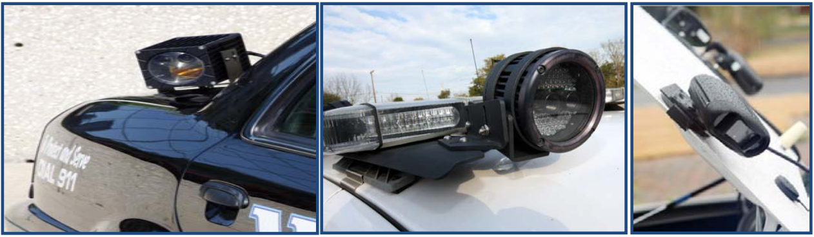(2)

I haven’t seen one (public) attempt to apply machine learning and image recognition to this tedious job.

According to a 2011 study, 71% of police agencies reported using ALPR and 85% plan to acquire or increase their use of the technology over the next five years.2

### The Job and ALPR

Owners of motorized vehicles driven on public thoroughfares are required by law to annually register their vehicles and to attach license plates that are publicly and legibly displayed.

  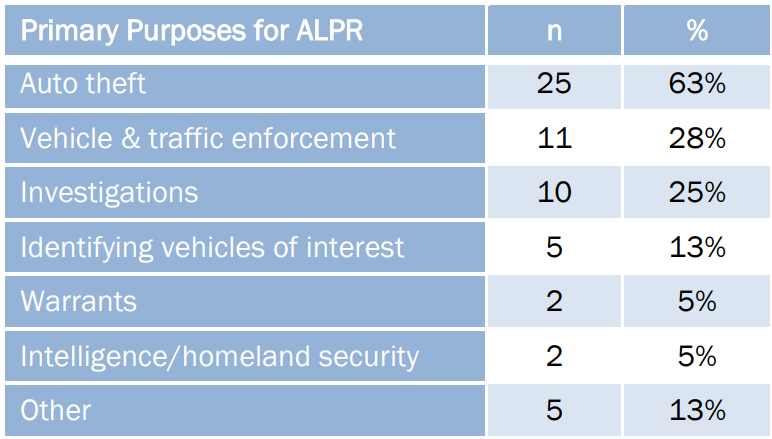(2)

Law enforcement are often searching for vehicles that have been reported stolen, have failed to maintain current vehicle license registration, are suspected of being involved in criminal activities, or any of a number of other legitimate reasons. To aid in this search ALPR Technology can relay the following information:

    a. Character and/or plate color
    b. Plate design factors (logos, stacked characters, etc.)
    c. State of origin (i.e., the state which issued the plate)
    d. Plate covers or other obstructions (e.g., bent, dirty, trailer hitch obstruction, etc.)
    e. Plate location on the vehicle
    f. Interval between vehicles
    g. Vehicle speed
    h. Lighting conditions (e.g., day vs. night)
    i. Weather conditions (e.g., snow, rain, fog)
    j. ALPR equipment (e.g., age and/or ability of the ALPR camera)
    k. ALPR implementation (e.g., camera angle) 

  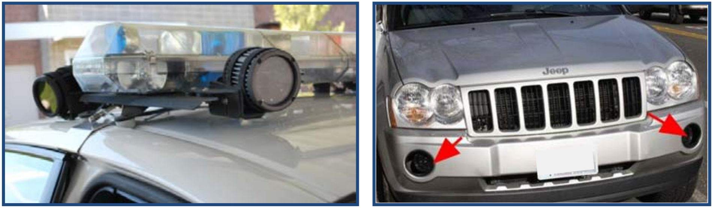

 
There are several types of ALPR systems that range in effectiveness. For example, the capture rate of mobile ALPR systems are often ~10% worse than stationary systems.

  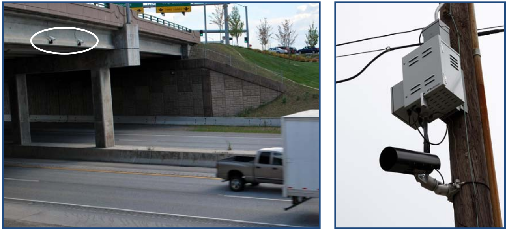

 

  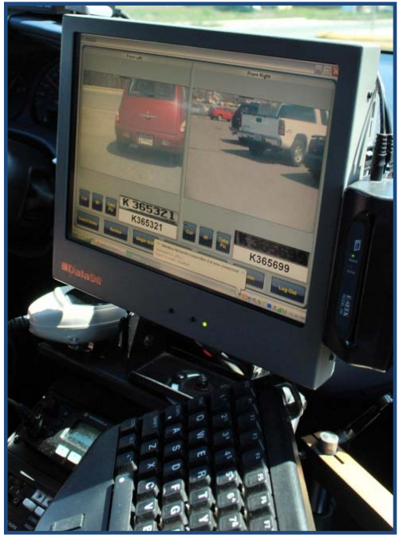

[Back to Top](#Table-of-Contents)

## Goals
### Minimum Viable Product
Classify car images with and accuracy comprable to that of ALPR's overall accuracy while minimizing false negatives.

  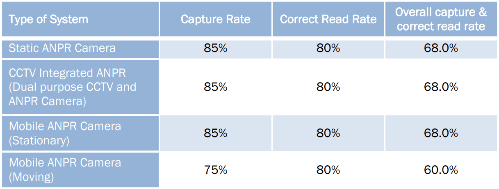

### Near-Future Goals (MVP+)

Deployable car image classifier application for mobile users that leverages their camera and wireless internet connection.

### Far-Future Goals (MVP++)

Deployable application for police mobile-computers.

Fully deployable, augmented reality, application for mobile devices that allow users to point towards an automobile and it, in real time, identifies the car and retrieves relevant information. Users can then look up cars with similar body styles, performance classes, prices, drivetrain styles, and more.

Improve the model by using user-submitted data.

[Back to Top](#Table-of-Contents)

## The Data

The dataset comes from vmmrdb.cecsresearch.org and consists of vehicle make/model/year labels assigned to images scraped from sites like Craigslist and Ebay. 

Containing 9,170 classes consisting of 291,752 images, covering models manufactured between 1950 to 2016 it is far from complete. 

Images were taken by different users, on different imaging devices, and cover multiple perspectives, ensuring a wide range of variations to account for various scenarios that could be encountered in a real-life scenario. The cars are not well aligned, and some images contain irrelevant backgrounds.

  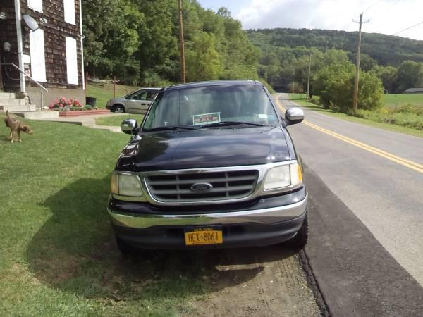
   
  <em>Above:</em> Originial Image (~600x500)

  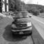
  
  

<em>Left:</em> 64x64 &nbsp; &nbsp;   &nbsp;   &nbsp;   &nbsp;   &nbsp;   &nbsp;  &nbsp; &nbsp;  &nbsp; | &nbsp;   &nbsp;  &nbsp;  &nbsp;  &nbsp; &nbsp; &nbsp;  &nbsp; <em>Middle:</em> 32x32 &nbsp; &nbsp;  &nbsp;  &nbsp; &nbsp;  &nbsp;  &nbsp; &nbsp;  | &nbsp;  &nbsp;  &nbsp; &nbsp;   &nbsp;   &nbsp;  &nbsp;  &nbsp;   &nbsp;  <em>Right:</em> 16x16

  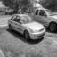
  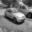
  
   
  <em>Below:</em> Originial Image (~600x500)

  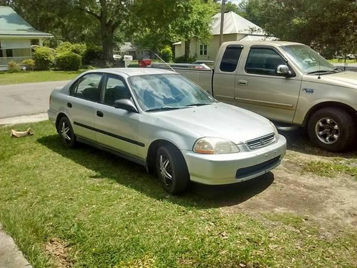

[Back to Top](#Table-of-Contents)

# Image Pipeline
## Transformations
Images were stored in folders according to the make, model, (sometimes sub-model or body-type), year. These label-named folders (with images inside) comprised the dataset. 

I read in a subset of the image files being sure to choose two classes that were visually different and that had many (hundreds) of images. The subset of images were scaled down (distorting some) and converted to grayscale.

Other transformations may prove useful when testing the model in the future. I'm excited to try applying zooms, crops, rotations, mirroring, bluring, sobel, canny, denoising, etc. This will greatly increase the size of the dataset.

[Back to Top](#Table-of-Contents)

# Model
## Random Forest

  (3)

Before choosing a model I researched the 'giants' for whom which I will standing on their shoulders. Muhammad Asif Manzoor and Yasser Morgan published a great paper detailing how they used a random forest classificatier on a similar problem. They describe a <em>successful</em> model architecture used for classifying vehicle make and model for intelligent transportation systems.

Out of boot (bag) score was very similar to, or better than, the test accuracy scores.

  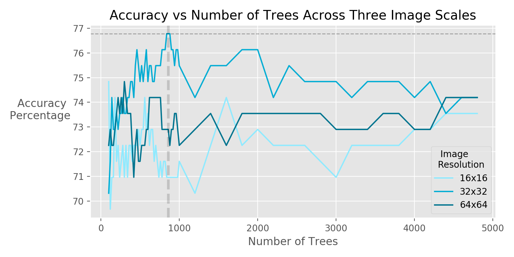

  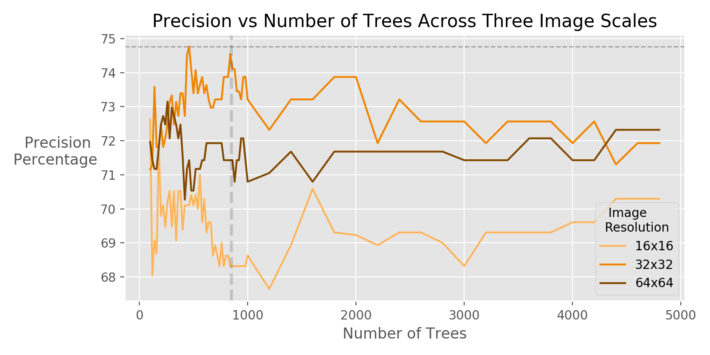

  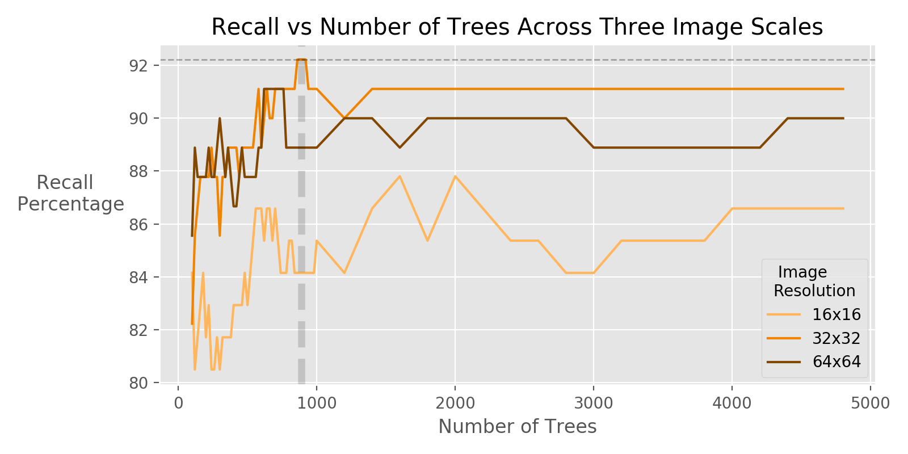

Next I'm looking forward to increase number of classes. With 14 classes, accuracy fell to around ~50%

[Back to Top](#Table-of-Contents)

# Conclusion

The dataset contains features that are going to allow me to correctly catagorize with an accuracy significantly better than guessing.

I'm very excited to continue working on this project.

[Back to Top](#Table-of-Contents)

# Citation

(1)*Car Image Dataset, http://vmmrdb.cecsresearch.org/*

(2)*Automated License Plate Reader Systems: Policy and Operational Guidance for Law Enforcement, https://www.ncjrs.gov/pdffiles1/nij/grants/239604.pdf*

(3)*forest 137, https://jooinn.com/forest-54.html*

(4)*M. A. Manzoor and Y. Morgan, "Vehicle make and model recognition using random forest classification for intelligent transportation systems," 2018 IEEE 8th Annual Computing and Communication Workshop and Conference (CCWC), Las Vegas, NV, 2018, pp. 148-154, doi: 10.1109/CCWC.2018.8301714.*

[Back to Top](#Table-of-Contents)

